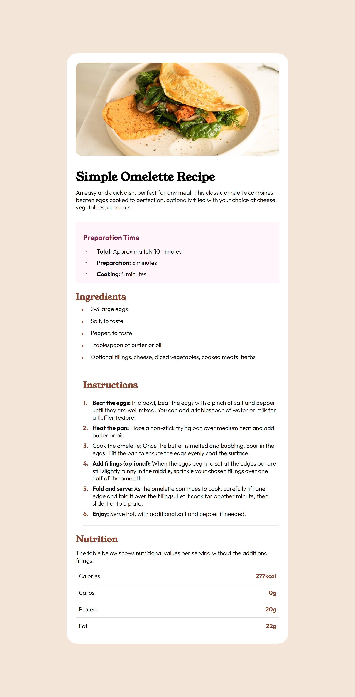
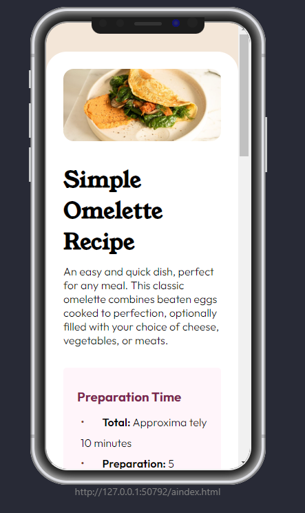

# Recipe Page

# Frontend Mentor - Recipe Page

This is a solution to the [Social links profile](https://www.frontendmentor.io/challenges/recipe-page-KiTsR8QQKm). Frontend Mentor challenges help you improve your coding skills by building realistic projects. 

## Table of contents

- [Overview](#overview)
  - [Screenshot](#screenshot)
  - [Links](#links)
- [My process](#my-process)
  - [Built with](#built-with)
  - [What I learned](#what-i-learned)
  - [Continued development](#continued-development)
  - [Useful resources](#useful-resources)
- [Author](#author)


## Overview

### Screenshot

-PC screenshot :



-Phone screenshot:



-Active States:


### Links

- Solution URL: (https://Shariar-Ahamed.github.io/Recipe_page/)

## My process

### Built with

- Semantic HTML5 markup
- CSS custom properties
- Use Some Tag


### What I learned

For me it was very dificult to choose the right properties in css to get the body and be seen as the style guide declared.

At the end, i believe i did a good job with the things that i used.
Always open to any comments  

```
/* Body Styles */
body {
  display: flex;
  justify-content: center;
  align-items: center;
  min-height: 100vh;
  background-color: var(--Stone1);
}

/* Main Div */
.main_div{
margin: 15% auto;
height: 90%;
width: 600px;
background-color: var(--White);
border-radius: 30px; 
padding: 25px;
}

/* Image */
img{
  
  border-radius: 15px;
  height: 100%;
  width: 100%;
}


h1{
  margin-top: 30px ;
  font-family: "Young Serif", serif;
  font-weight: 700;
  font-style: normal;
}


.div_p{
  margin-top: 10px ;
  font-family: "Outfit", sans-serif;
  font-weight:300;
  font-style: normal;
}

.preparation_time{
  margin-top: 30px;
  background-color: var(--Rose1);
  padding: 10px;
  border-radius: 5px; 
}

.preparation_time h3{
 font-size: 900;
 font-family: "Outfit", sans-serif;
 padding: 20px 0px 10px 10px;
 color: var(--Rose);
}

.preparation_time ul{
  line-height: 30px;
  
}

.preparation_time ul li{
  list-style-position: inside;
  margin-left: 15px;
  font-family: "Outfit", sans-serif;
  font-weight:300;
  font-style: normal;
}

.preparation_time ul li::before {
  content: "•";
  color: #854632; 
  font-size: 18px;
  display: inline-block;
  width: 1em;
  margin-right: 10px;
}

.preparation_time ul li span{
  font-weight:600;
}


/* Ingredients */
.Ingredients h2{
  margin-top: 20px;
  font-family: "Young Serif", serif;
  font-weight: 600;
  font-style: normal;
  color: var(--Brown);
}

.Ingredients ul{
  line-height: 30px;
  
}

.Ingredients ul li{
  list-style-position: inside;
  margin-left: 15px;
  font-family: "Outfit", sans-serif;
  font-weight:300;
  font-style: normal;
}

.Ingredients ul li::before {
  content: "■";
  color: #854632; 
  font-size: 10px;
  display: inline-block;
  width: 1em;
  margin-right: 15px;
}

hr{
  margin: 20px auto;
  width: 100%;
  color: rgb(233, 199, 199);
}


/* Instructions  */
.instructions h2{
  margin: 20px 0px;
  font-family: "Young Serif", serif;
  font-weight: 600;
  font-style: normal;
  color: var(--Brown);
}


.instructions {
  counter-reset: my-counter;
  list-style: none;
  padding-left: 20px;
}

.instructions li {
  counter-increment: my-counter;
  position: relative;
  margin-bottom: 8px;
  padding-left: 25px;
  color: black; /* Text color */
  font-family: "Outfit", sans-serif;
  font-weight:300;
  font-style: normal;
}

.instructions ol li::before {
  content: counter(my-counter) ".";
  position: absolute;
  left: 0;
  color: #854632; /* Number color */
  font-weight: bold;
}

.font_bold{
  font-weight: 600;
}


/* Nutrition */
.nutrition-section h2 {
  margin-top: 10px;
  font-family: "Young Serif", serif;
  font-weight: 600;
  font-style: normal;
  color: var(--Brown);
}

.nutrition-section p {
  padding-top: 10px ;
  font-family: "Outfit", sans-serif;
  font-weight:300;
  font-style: normal;
}

.nutrition-table {
  font-family: "Outfit", sans-serif;
  font-weight:300;
  font-style: normal;
  margin-top: 10px;
  width: 100%;
  border-collapse: collapse;
}

```

### Continued development
*****************

## Author
- Frontend Mentor - [@sharierahmed11](https://www.frontendmentor.io/profile/sharierahmed11)


